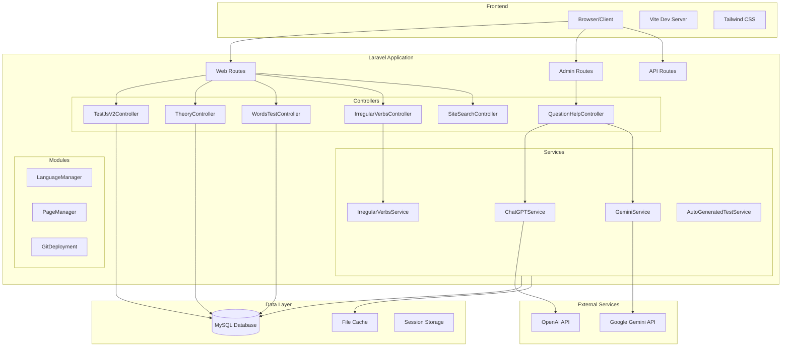
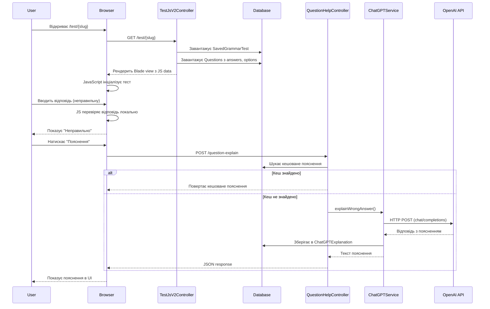
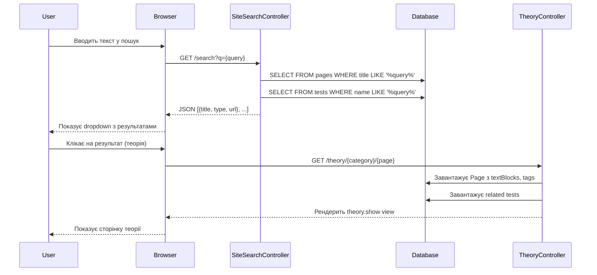

# ARCHITECTURE.md — Архітектура Gramlyze

## Високорівнева схема компонентів

---

## Точки входу

### Web Routes (`routes/web.php`)
Публічні маршрути для користувачів:
- `/` — головна сторінка
- `/pages`, `/theory` — теоретичні матеріали
- `/test/{slug}` — граматичні тести (різні режими)
- `/words/test` — тренажер слів
- `/verbs/test` — тренажер дієслів
- `/search` — глобальний пошук
- `/catalog/tests-cards` — каталог тестів

### Admin Routes (`routes/admin.php`)
Маршрути для адміністраторів (захищені middleware `auth.admin`):
- `/admin/` — дашборд
- `/admin/test-tags/` — управління тегами
- `/admin/grammar-test` — генерація тестів
- `/admin/seed-runs` — управління сідерами
- `/admin/site-tree` — управління структурою сайту
- `/admin/words/export` — експорт/імпорт слів

### API Routes (`routes/api.php`)
- `/api/search` — пошук слів (autocomplete)
- `/api/user` — інформація про користувача (Sanctum)

### Console Commands (`routes/console.php`)
- `inspire` — демо команда
- Немає кастомних scheduled tasks (в поточній версії)

---

## Основні доменні модулі

### 1. Catalog (Каталог тестів)
**Файли:**
- `app/Http/Controllers/GrammarTestController.php`
- `app/Models/SavedGrammarTest.php`
- `app/Models/SavedGrammarTestQuestion.php`
- `resources/views/saved-tests.blade.php`

**Функціонал:**
- Відображення списку тестів картками
- Фільтрація за тегами/категоріями

### 2. Theory (Теорія)
**Файли:**
- `app/Http/Controllers/TheoryController.php`
- `app/Http/Controllers/PageController.php`
- `app/Models/Page.php`
- `app/Models/PageCategory.php`
- `app/Models/TextBlock.php`
- `resources/views/engram/theory/`

**Функціонал:**
- Ієрархія категорій та сторінок
- Блоки контенту з локалізацією
- Пов'язані тести на основі тегів

### 3. Words Trainer (Тренажер слів)
**Файли:**
- `app/Http/Controllers/WordsTestController.php`
- `app/Models/Word.php`
- `app/Models/Translate.php`
- `resources/views/words/test.blade.php`

**Функціонал:**
- Три рівні складності (easy, medium, hard)
- Вибір мови навчання (UK, PL)
- Відстеження прогресу в сесії

### 4. Verbs Trainer (Тренажер дієслів)
**Файли:**
- `app/Http/Controllers/IrregularVerbsTestController.php`
- `app/Services/IrregularVerbsService.php`
- `resources/views/verbs/test.blade.php`

**Функціонал:**
- База неправильних дієслів (base, past, participle)
- Автогенерація форм -s, -ing

### 5. Search (Пошук)
**Файли:**
- `app/Http/Controllers/SiteSearchController.php`
- `app/Http/Controllers/WordSearchController.php`
- `resources/views/search/results.blade.php`

**Функціонал:**
- Пошук по сторінках теорії
- Пошук по тестах
- Autocomplete для слів

### 6. AI Hints (AI-підказки)
**Файли:**
- `app/Http/Controllers/QuestionHelpController.php`
- `app/Services/ChatGPTService.php`
- `app/Services/GeminiService.php`
- `app/Models/QuestionHint.php`
- `app/Models/ChatGPTExplanation.php`

**Функціонал:**
- Пояснення неправильних відповідей
- Підказки щодо структури речення
- Визначення рівня CEFR
- Кешування відповідей у БД

### 7. Admin/Content Management
**Файли:**
- `app/Http/Controllers/SeedRunController.php`
- `app/Http/Controllers/TestTagController.php`
- `app/Http/Controllers/SiteTreeController.php`
- `app/Modules/GitDeployment/`

**Функціонал:**
- Запуск сідерів через UI
- Управління тегами та агрегаціями
- Структура дерева сайту
- GitHub деплоймент

---

## Sequence Diagram: Запуск тесту + AI-підказка

---

## Sequence Diagram: Глобальний пошук → Теорія

