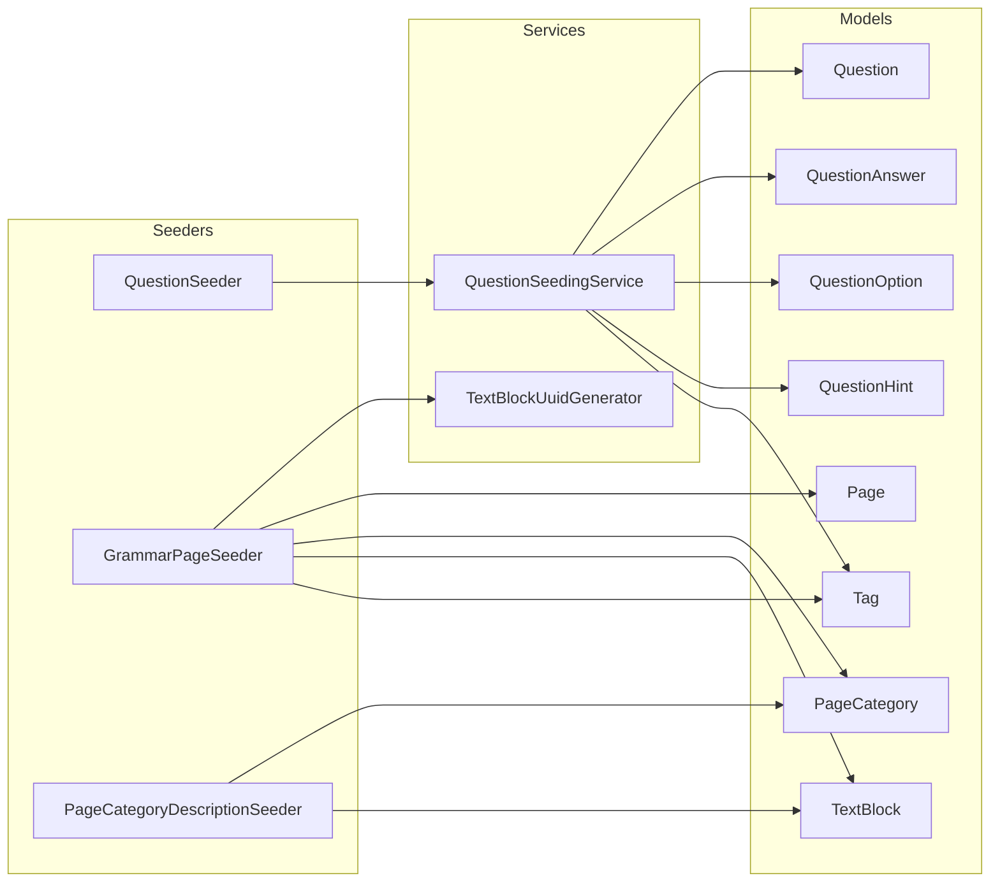

# SEEDERS.md — Архітектура сідерів

## Огляд

Проєкт використовує кастомну систему сідерів для завантаження контенту (граматичних тестів і сторінок теорії) в базу даних. Система дозволяє:
- Версіонування контенту через Git
- Запуск сідерів через адмін-панель
- Попередній перегляд (preview) питань перед виконанням
- Відстеження виконаних сідерів у таблиці `seed_runs`

---

## Структура папок сідерів

```
database/seeders/
├── DatabaseSeeder.php              # Головний сідер Laravel
├── QuestionSeeder.php              # Базовий клас для сідерів питань
├── V1/                             # Перше покоління сідерів
│   ├── Questions/                  # Сідери питань
│   ├── Metadata/                   # Сідери метаданих (теги, рівні)
│   ├── Tenses/                     # Сідери часів
│   └── Translation/                # Сідери перекладів
├── V2/                             # Друге покоління сідерів
├── AI/                             # AI-генеровані питання (ChatGPT)
├── chatGpt/                        # Legacy AI сідери
├── DragDrop/                       # Drag&Drop питання
├── Pages/                          # Сідери сторінок теорії
│   ├── Concerns/                   # Базові класи
│   │   ├── GrammarPageSeeder.php   # Базовий клас для сторінок
│   │   └── PageCategoryDescriptionSeeder.php
│   ├── GrammarPagesSeeder.php      # Агрегатор всіх сторінок
│   ├── Tenses/                     # Сторінки часів
│   ├── Articles/                   # Сторінки артиклів
│   ├── Modals/                     # Сторінки модальних дієслів
│   └── ...                         # Інші категорії
└── Page_v2/                        # Нова версія сторінок
```

---

## Базові класи

### 1. `App\Support\Database\Seeder`

**Шлях**: `app/Support/Database/Seeder.php`

Розширює стандартний `Illuminate\Database\Seeder` з додатковим функціоналом:

```php
abstract class Seeder extends BaseSeeder
{
    // Перевіряє чи сідер вже виконувався
    protected function shouldRun(): bool
    {
        return !DB::table('seed_runs')
            ->where('class_name', static::class)
            ->exists();
    }

    // Логує виконання в seed_runs
    protected function logRun(): void
    {
        DB::table('seed_runs')->updateOrInsert(
            ['class_name' => static::class],
            ['ran_at' => now()]
        );
    }
}
```

### 2. `Database\Seeders\QuestionSeeder`

**Шлях**: `database/seeders/QuestionSeeder.php`

Базовий клас для сідерів питань:

```php
abstract class QuestionSeeder extends Seeder
{
    // Генерує детермінований UUID для питання
    protected function generateQuestionUuid(int|string ...$segments): string;
    
    // Основний метод для збереження питань
    protected function seedQuestionData(array $items, array $meta): void;
    
    // Синхронізує теги маркерів (gap_tags)
    protected function syncMarkerTags(int $questionId, array $gapTags): void;
}
```

### 3. `Database\Seeders\Pages\Concerns\GrammarPageSeeder`

**Шлях**: `database/seeders/Pages/Concerns/GrammarPageSeeder.php`

Базовий клас для сторінок теорії з підтримкою BLOCK-FIRST TAGGING:

```php
abstract class GrammarPageSeeder extends Seeder
{
    // Обов'язкові методи для реалізації
    abstract protected function slug(): string;
    abstract protected function page(): array;
    
    // Опціональні методи
    protected function type(): ?string;       // Тип сторінки (null або 'theory')
    protected function category(): ?array;    // Категорія сторінки
}
```

---

## Структура даних сідерів

### Question Seeder Data Format

```php
$items = [
    [
        'uuid' => 'present-simple-q1',           // Унікальний ID питання
        'question' => 'She {a1} to school.',      // Текст з маркерами
        'category_id' => 2,                       // ID категорії
        'source_id' => 1,                         // ID джерела
        'difficulty' => 1,                        // Складність (1-3)
        'level' => 'A1',                          // CEFR рівень
        'type' => null,                           // Тип (null, 1, 2, 3)
        'flag' => 0,                              // Прапорець
        'answers' => [
            [
                'marker' => 'a1',                 // Маркер у тексті
                'answer' => 'goes',               // Правильна відповідь
                'verb_hint' => 'go',              // Підказка дієслова (опц.)
            ],
        ],
        'options' => ['goes', 'go', 'going'],    // Варіанти відповідей
        'tag_ids' => [1, 2],                     // ID тегів
        'variants' => [...],                     // Варіанти питання
        'options_by_marker' => [                 // Опції по маркерах
            'a1' => ['goes', 'go', 'went'],
        ],
    ],
];

$meta = [
    [
        'uuid' => 'present-simple-q1',
        'hints' => ['Present Simple', 'Третя особа'],
        'gap_tags' => [                          // Теги для конкретних маркерів
            'a1' => ['Present Simple', '3rd person'],
        ],
        'explanations' => [                      // Пояснення помилок
            'go' => 'Для he/she/it потрібно додати -s.',
            'going' => 'Present Simple не використовує -ing форму.',
        ],
        'answers' => ['a1' => 'goes'],
        'option_markers' => ['go' => 'a1'],
    ],
];

// Виклик
$this->seedQuestionData($items, $meta);
```

### Page Seeder Data Format

```php
protected function page(): array
{
    return [
        'title' => 'Present Simple — Теперішній простий час',
        'subtitle_html' => '<strong>...</strong>',  // HTML підзаголовок
        'subtitle_text' => '...',                   // Текстовий підзаголовок
        'locale' => 'uk',                           // Мова контенту
        'tags' => ['Present Simple', 'tenses'],     // Теги сторінки
        'base_tags' => ['Present Simple'],          // Теги для наслідування
        'category' => [                             // Категорія
            'slug' => 'tenses',
            'title' => 'Часи',
            'language' => 'uk',
        ],
        'blocks' => [
            [
                'column' => 'left',                 // left або right
                'heading' => 'Коли вживати?',       // Заголовок блоку
                'type' => 'box',                    // Тип блоку
                'css_class' => null,                // CSS клас
                'body' => '<ul>...</ul>',           // HTML контент
                'tags' => ['usage'],                // Теги блоку
                'inherit_base_tags' => true,        // Наслідувати base_tags
                'uuid_key' => 'when-to-use',        // Ключ для UUID
            ],
            // ... більше блоків
        ],
    ];
}
```

---

## Сервіси для сідерів

### QuestionSeedingService

**Шлях**: `app/Services/QuestionSeedingService.php`

Обробляє логіку збереження питань:

```php
class QuestionSeedingService
{
    public function seed(array $items): void
    {
        foreach ($items as $data) {
            DB::transaction(function () use ($data, $seederClass) {
                // 1. Знаходить існуюче питання по UUID або тексту
                $question = $this->locateExistingQuestion($data);
                
                // 2. Забезпечує існування категорії
                $this->ensureCategoryExists($data['category_id']);
                
                // 3. Створює/оновлює питання
                if ($question) {
                    $question->forceFill($attributes)->save();
                } else {
                    $question = Question::create($attributes);
                }
                
                // 4. Перестворює зв'язки
                $this->recreateQuestionRelations($question, $data);
            });
        }
    }
}
```

### TextBlockUuidGenerator

**Шлях**: `app/Support/TextBlock/TextBlockUuidGenerator.php`

Генерує детерміновані UUID для TextBlock:

```php
class TextBlockUuidGenerator
{
    // UUID за індексом
    public static function generate(string $seederClass, int $blockIndex): string;
    
    // UUID за ключем
    public static function generateWithKey(string $seederClass, string $key): string;
    
    // Пошук блоку
    public static function findByUuid(string $uuid): ?TextBlock;
}
```

---

## Адмін-панель сідерів

### SeedRunController

**Шлях**: `app/Http/Controllers/SeedRunController.php`

**Маршрут**: `/admin/seed-runs`

**Функціонал**:

| Метод | Route | Опис |
|-------|-------|------|
| `index()` | GET `/admin/seed-runs` | Список сідерів (виконані/очікуючі) |
| `preview()` | GET `/admin/seed-runs/preview` | Попередній перегляд питань/сторінок |
| `run()` | POST `/admin/seed-runs/run` | Запуск окремого сідера |
| `runMissing()` | POST `/admin/seed-runs/run-missing` | Запуск всіх невиконаних |
| `refresh()` | POST `/admin/seed-runs/{id}/refresh` | Перезапуск (видалити + створити) |
| `destroy()` | DELETE `/admin/seed-runs/{id}` | Видалити запис |
| `destroyWithQuestions()` | DELETE `/admin/seed-runs/{id}/with-questions` | Видалити з питаннями |
| `destroyFolder()` | DELETE `/admin/seed-runs/folder` | Видалити папку сідерів |

### Preview функціонал

Контролер підтримує preview для трьох типів сідерів:

```php
protected function buildSeederPreview(string $className): array
{
    // QuestionSeeder — показує питання з відповідями
    if (is_subclass_of($className, QuestionSeederBase::class)) {
        return $this->buildQuestionSeederPreview($className);
    }

    // GrammarPageSeeder — показує HTML сторінки
    if (is_subclass_of($className, GrammarPageSeederBase::class)) {
        return $this->buildPageSeederPreview($className);
    }

    // PageCategoryDescriptionSeeder — показує категорію
    if (is_subclass_of($className, PageCategoryDescriptionSeederBase::class)) {
        return $this->buildCategorySeederPreview($className);
    }
}
```

---

## Таблиця seed_runs

**Структура**:

```sql
CREATE TABLE seed_runs (
    id BIGINT PRIMARY KEY AUTO_INCREMENT,
    class_name VARCHAR(255) UNIQUE,   -- Повне ім'я класу сідера
    ran_at TIMESTAMP                   -- Час виконання
);
```

**Призначення**:
- Відстеження виконаних сідерів
- Запобігання повторному запуску
- Можливість видалення пов'язаних даних

---

## BLOCK-FIRST TAGGING

Принцип тегування сторінок теорії:

### Ієрархія тегів

```
Page Level:
├── page.tags[]          ─── Anchor теги сторінки (2-8 тегів)
└── page.base_tags[]     ─── Теги для наслідування блоками

Block Level:
├── block.tags[]         ─── Деталізовані теги блоку
└── block.inherit_base_tags  ─── Чи наслідувати base_tags
```

### Агрегація тегів

```
Final Page Tags = union(all block tags) + page anchor tags
```

### Приклад

```php
[
    'tags' => ['Present Simple', 'tenses'],           // Anchor tags
    'base_tags' => ['Present Simple'],                 // Для наслідування
    'blocks' => [
        [
            'tags' => ['affirmative', 'structure'],   // Деталізовані
            'inherit_base_tags' => true,               // = ['Present Simple', 'affirmative', 'structure']
        ],
        [
            'tags' => ['negative', 'structure'],
            'inherit_base_tags' => true,
        ],
    ],
]

// Результат:
// Block 1 tags: ['Present Simple', 'affirmative', 'structure']
// Block 2 tags: ['Present Simple', 'negative', 'structure']
// Page tags: ['Present Simple', 'tenses', 'affirmative', 'structure', 'negative']
```

---

## Типи питань

| Type | Назва | Опис |
|------|-------|------|
| `null` | Standard | Стандартне питання з gap-ами |
| `1` | Match | Зіставлення |
| `2` | Dialogue | Діалогове питання |
| `3` | Drag & Drop | Перетягування елементів |

---

## Workflow створення сідера

### 1. Question Seeder

```php
<?php

namespace Database\Seeders\V2\Tenses;

use Database\Seeders\QuestionSeeder;
use App\Models\Category;
use App\Models\Source;

class PresentSimpleExerciseSeeder extends QuestionSeeder
{
    public function run(): void
    {
        $categoryId = Category::firstOrCreate(['name' => 'Present Simple'])->id;
        $sourceId = Source::firstOrCreate(['name' => 'Present Simple Exercises'])->id;

        $items = [];
        $meta = [];

        // Додаємо питання
        $items[] = [
            'uuid' => $this->generateQuestionUuid(1),
            'question' => 'She {a1} to work every day.',
            'category_id' => $categoryId,
            'source_id' => $sourceId,
            'level' => 'A1',
            'answers' => [
                ['marker' => 'a1', 'answer' => 'goes'],
            ],
            'options' => ['goes', 'go', 'going', 'went'],
        ];

        $meta[] = [
            'uuid' => $this->generateQuestionUuid(1),
            'hints' => ['Present Simple для he/she/it'],
            'explanations' => [
                'go' => 'Для третьої особи (she) потрібно додати -es: goes.',
            ],
        ];

        $this->seedQuestionData($items, $meta);
    }
}
```

### 2. Page Seeder

```php
<?php

namespace Database\Seeders\Pages\Tenses;

use Database\Seeders\Pages\Concerns\GrammarPageSeeder;

class FutureSimplePageSeeder extends GrammarPageSeeder
{
    protected function slug(): string
    {
        return 'future-simple';
    }

    protected function category(): ?array
    {
        return [
            'slug' => 'tenses',
            'title' => 'Часи',
        ];
    }

    protected function page(): array
    {
        return [
            'title' => 'Future Simple — Майбутній простий час',
            'locale' => 'uk',
            'tags' => ['Future Simple', 'will', 'tenses'],
            'subtitle_html' => '<strong>Will + V1</strong> для передбачень і рішень.',
            'blocks' => [
                [
                    'column' => 'left',
                    'heading' => 'Формула',
                    'body' => '<pre>Subject + will + V1</pre>',
                    'tags' => ['formula', 'structure'],
                ],
            ],
        ];
    }
}
```

---

## Корисні команди

```bash
# Запустити конкретний сідер
php artisan db:seed --class=Database\\Seeders\\V2\\Tenses\\PresentSimpleSeeder

# Запустити всі сідери
php artisan db:seed

# Скинути seed_runs (для перезапуску всіх)
php artisan tinker
>>> DB::table('seed_runs')->truncate();

# Переглянути виконані сідери
>>> DB::table('seed_runs')->get();
```

---

## Зв'язок сідерів з моделями


